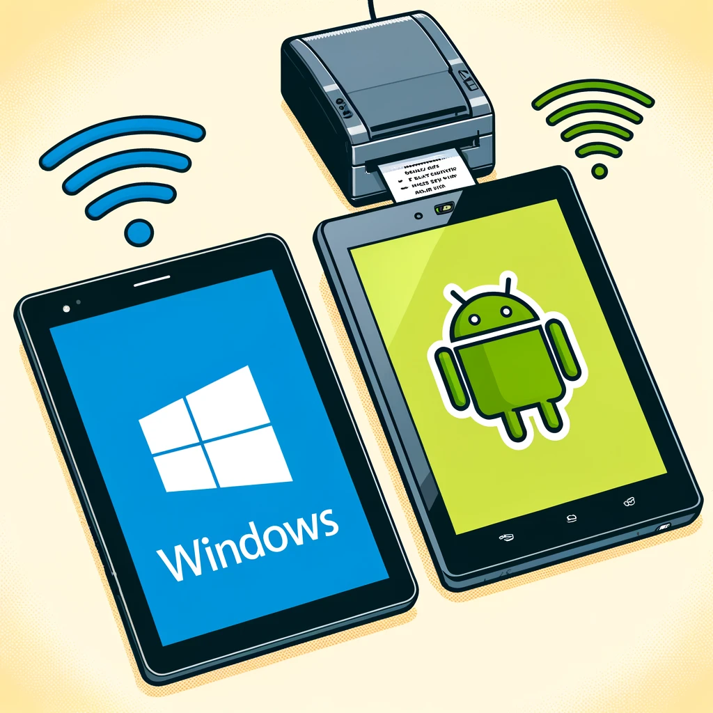

# Hardware Requirements

## Hardware Requirements

Welcome to the CloudWaitress Hardware Requirements page. Having the right hardware setup is crucial for the smooth operation of your restaurant's online ordering system. Below are our updated recommendations for a seamless experience in 2024.

### Stable Internet Connection

A stable internet connection is essential for our cloud-based system. Here are some tips:

* **Dedicated Internet:** Use a dedicated Internet connection to ensure reliability.
* **Backup Connection:** Keep a 5G mobile internet connection as a backup. In case of interruptions, use your phone in hotspot mode.
* **Primary 5G Connection:** Consider exclusively using a 5G connection in areas with reliable mobile networks.


**Firewall Settings:** Ensure cloudwaitress.com is white-listed on your firewall to prevent connection issues.


## Computer or Tablet

A device with internet access is essential to manage your online store and orders effectively. Tablets or larger devices are preferred, and we recommend a screen size of 9" or larger. While phone access is possible, it may be limiting.

#### Recommended Devices:

* **Android Tablets:** Latest version of Android (compatibility from Android 1.5)
* **Windows Tablets/Computers:** Windows 11 (Compatibility for Windows XP, Windows Vista, Windows 7, Windows 8, Windows 8.1 and Windows 10)
* **Linux:** Requires NodeJS

#### Recommended Computers & Tablets

We highly recommend using an Android device or Windows tablet/computer. Windows provides the greatest flexibility and allows wireless order printing while using the order and table booking dashboard.

**Worldwide Device Recommendations:**

| Brand         | Model              | Type    | Notes                                       |
| ------------- | ------------------ | ------- | ------------------------------------------- |
| **Lenovo**    | M10 Series         | Android | Reliable, versatile, good for various tasks |
| **Samsung**   | Galaxy Tab S7      | Android | High performance, excellent display         |
| **Samsung**   | Galaxy Tab A7 Lite | Android | Affordable, lightweight                     |
| **HP**        | Envy x2            | Windows | Flexible, good battery life                 |
| **Microsoft** | Surface Pro 7      | Windows | High performance, versatile                 |
| **Microsoft** | Surface Go 3       | Windows | Portable, budget-friendly                   |
| **Lenovo**    | Yoga Duet 7i       | Windows | 2-in-1, powerful and flexible               |
| **Chuwi**     | Hi10 X             | Windows | Affordable, decent performance              |

***

## Printers


Printers are optional but useful for managing orders.  We highly recommend using a thermal receipt printer.


#### From Windows

You can print orders using any printer with drivers installed on a Windows PC. If you can print from an application like Word or Notepad, it's compatible with our service.

#### From Android

You can use any ESCPOS printer that is accessible via the network with an IP address (i.e., Ethernet, Wi-Fi) or connect via Bluetooth.

### Recommended Printers

We recommend printers from [PushPrinter](https://www.pushprinter.com) as we trust and endorse these devices. Additionally, you can use any printer with Windows or Linux drivers or any printer that works with ESCPOS using Android.

**Branded Printers (from lowest to highest price):**

* PushPrinter PX-90 (Ethernet or Bluetooth)
* Epson TM-T20 (USB or Ethernet)
* Epson TM-M30 (Bluetooth)
* Epson TM-T82-II-i (USB and Ethernet, supporting many connected devices)

**Note:** We do NOT recommend Star printers for use with Android. If you are looking to purchase a new printer, we suggest avoiding Star printers at this point in time.

**Other Printers:**


We do NOT recommend Star printers for use with Android.  If you are looking to purchase a new printer, we suggest avoiding Star printers at this point in time.


* Star Micronics TSP143 (Bluetooth, USB, or Wi-Fi)

For more detailed information and step-by-step guides, visit the following pages:

* [How to Optimize Your Internet Connection](https://support.cloudwaitress.com/internet-optimization)
* [Choosing the Best Printer for Your Restaurant](https://support.cloudwaitress.com/printer-guide)

## Ideal Setup

<figure><figcaption>
Windows/Adnroid tablet connected to Thermal Kitchen reciept printer is an ideal setup
</figcaption></figure>

***

### Frequently Asked Questions (FAQs)

**Q: Can I use a mobile phone for managing orders?** A: Yes, but we recommend using a tablet or a larger device for a better experience.

**Q: What should I do if my internet connection is unstable?** A: Consider using a 5G mobile connection as a backup or exclusively if reliable.

For further assistance, feel free to [contact us](https://support.cloudwaitress.com/contact).

Explore more at [CloudWaitress.com](https://www.cloudwaitress.com).

***

Next: [Getting Started](https://support.cloudwaitress.com/getting-started)
