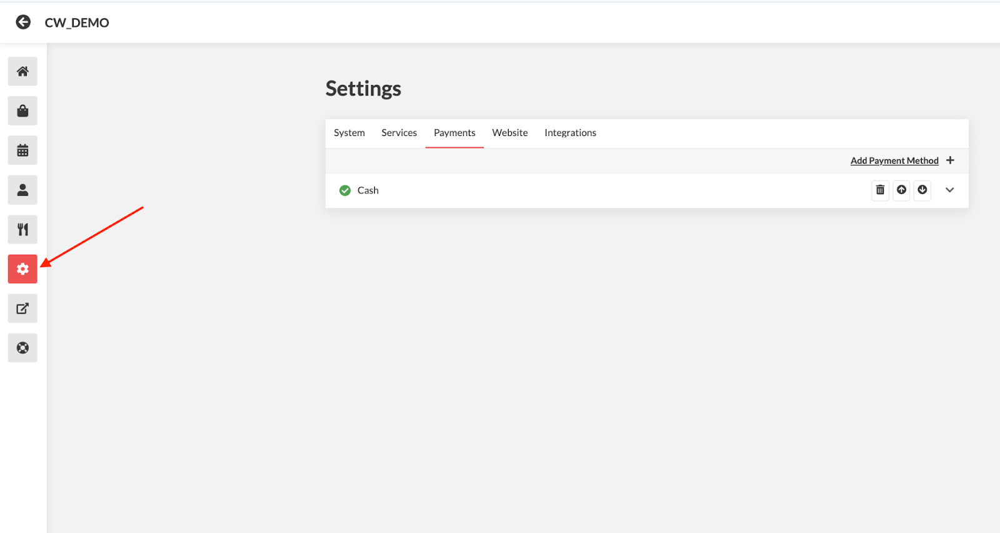

# Configure Custom Payment Methods



### Steps:

1. On the Admin Dashboard, click on the Settings Icon

<figure><figcaption></figcaption></figure>

2. Select **Payments** tab > Add **Payment Method**

<figure><figcaption></figcaption></figure>

3. Choose **Custom** from the Payment Method list > **Add Method**

<figure><figcaption></figcaption></figure>

### Once added you can configure the settings:

<figure><figcaption></figcaption></figure>

4. **Enable** the Custom Payment Method
5. **Services:** Choose which services this payment method will be restricted to (e.g., Pickup, Delivery, Dine-In, Table Booking).
6. **Label:** Enter a label for the payment method (e.g., PAY AT THE COUNTER).
   * **Delivery Label (Optional)**\
     Enter a different label for delivery orders if needed. Leave blank if not.
   * **Print Label**\
     Set the label that will appear on printed or PDF receipts.
7. **Maximum Order Value ($)**\
   Specify the maximum order value for which this payment method will be available.
8. Click **Save** to apply the changes.


Please email [support@cloudwaitress.com](mailto:support@cloudwaitress.com) or use the chat support feature to get assistance managing this feature.

