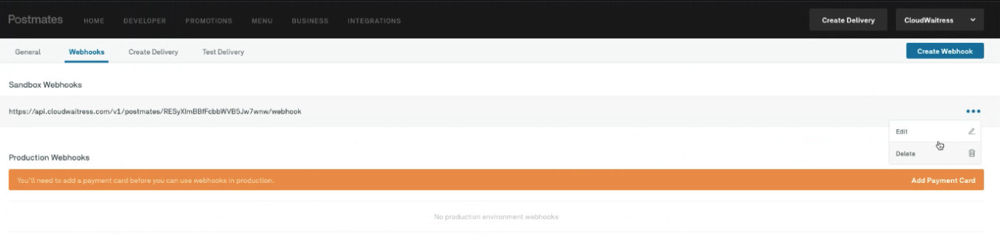
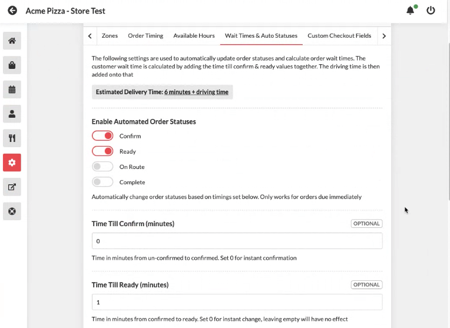
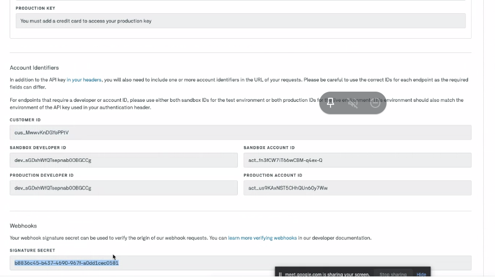
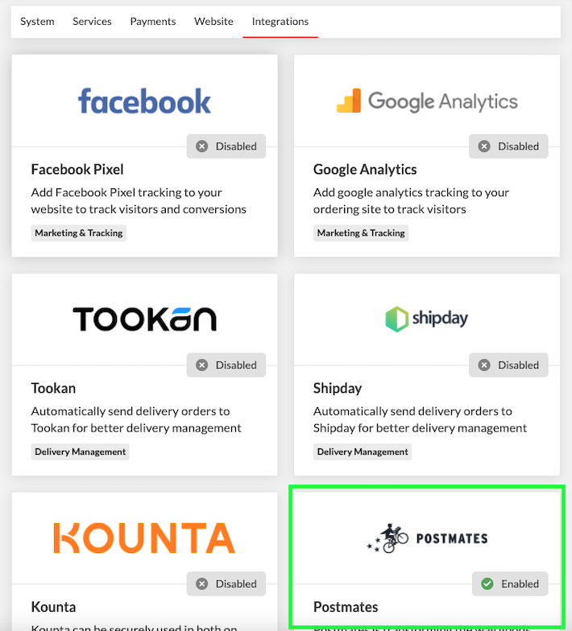
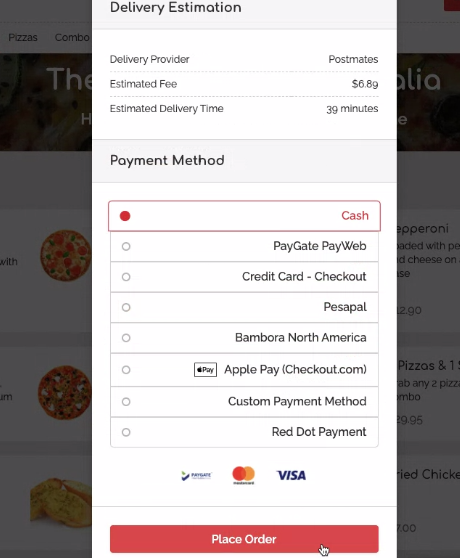
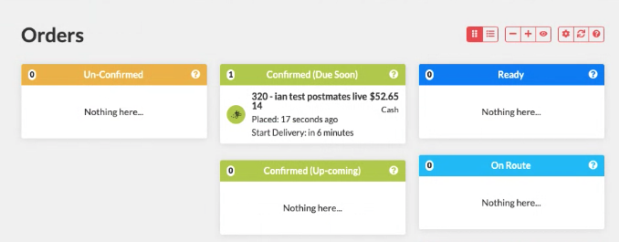
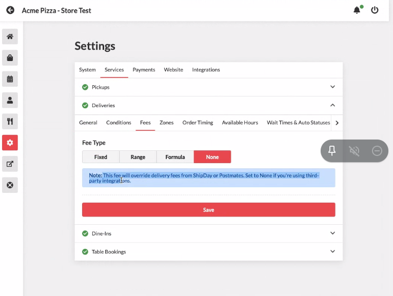
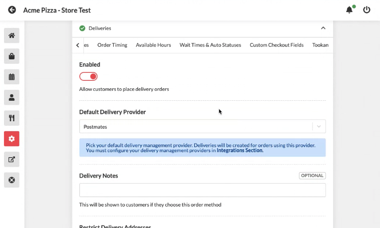
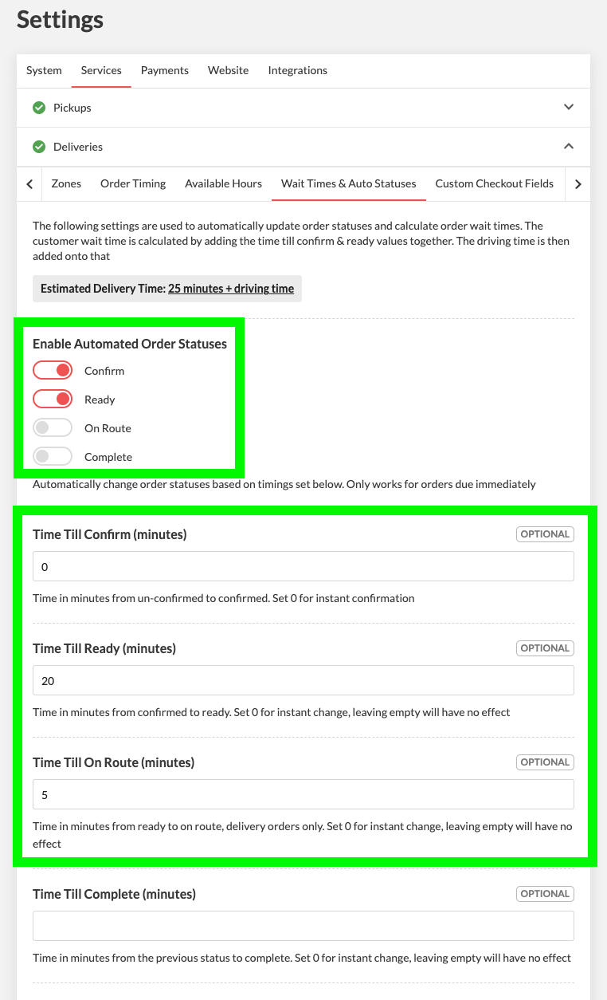

# How to integrate Postmates with CloudWaitress

## POSTMATES Integration


**Which cities is Postmates available in?**

[This is the updated list of cities where Postmates is available](https://www.notion.so/cloudwaitresswiki/POSTMATES-Integration-ca913853d3ad493eb935d2a5f1120c30#8f10f90feb7a4b94ab35dfdbe0b14158)


## How to set-up CloudWaitress &gt; Postmates integration




1 - Login to Postmates account at - partner.postmates.com

2 - Click Developer &gt; Webhooks &gt; Create Webhook

3 - Paste the API URL into the Production and Sandbox 'Webhooks' section. The API URL for the webhook can be found in your restaurant dasboard under settings &gt; integrations &gt; Postmates &gt; Postmates Webhook URL




For testing please make sure the 'wait times & auto statuses' are set as below;

Confirm = On at 0mins

Ready= On at 0min




Below are the keys in Postmates that you will need to use when adding to the Shipday integration settings within the restaurant \(Settings &gt; Integrations &gt; Postmates\);

* Sandbox Key \(Authentication Key for testing\)
* Production Key \(Authentication Key for live\)
* Customer ID
* Signature Secret

Add the values from your Postmates account as per below \(Settings &gt; Integrations &gt; Postmates\);




Post mates will show during the checkout;

Postmates deliveries will show on the dashboard with the Postmates logo;




## **Creating Postmates account**

Adding Postmates as your delivery driving service is simple and it will help increase your sales to customers who want order delivered right to their door.

**Setting up the Account and Payment method**

You will first need to create a Postmates Developer account which can be found at this link: [https://postmates.com/developer](https://postmates.com/developer)

Once you enter in your restaurant information, you will be redirected to the Postmates Dashboard. In order to get the Postmates information we need, you have to enter a payment method so Postmates can charge it once an order is complete. To do this, click on “Add Payment Card”, enter your credit card information, and “Save”. Now that you have entered your credit card information, you will see some different “keys” show up on the screen.

## ESSENTIAL SETTINGS


IMPORTANT - The following settings must be applied for the Postmates integration to work.


**In Cloudwaitress the following settings must be applied;**

1. Generate and add the webhook to Postmates \(details above\)

2. Add the Postmates keys into restaurant dashboard. Settings &gt; Integrations &gt; Postmates.

3. Settings &gt; Services &gt; Deliveries &gt; Fees &gt; None

4. Settings &gt; Services &gt; Deliveries &gt; General &gt; Default Delivery Provider = Postmates

5. Settings &gt; Services &gt; Deliveries &gt; Wait Times & Auto Statuses

The following settings MUST be enabled;

* Time till confirm \(minutes\)
* Time Till Ready \(minutes\)
* Time till on route \(mins\)

Note: You can set different timings for these fields and you can use the other fields within this section, however this wont impact the Postmates integration.

## FAQ

* **What if I already have a Postmates account and are on their app? Do I still need a developer account?**

  You should already have access to the Developer section of Postmates, and all you will need to do is copy the existing keys into the CloudWaitress Admin Dashboard.

