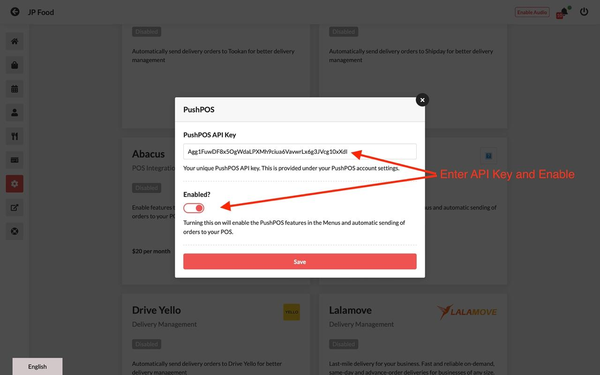

# How To Integrate PushPOS with CloudWaitress

Integrating online ordering with your POS system transforms manual system into an automated and efficient operation, making the entire process faster, more reliable, and, ultimately, more profitable.

### Steps:

1. Log in to your account [https://admin.cloudwaitress.com/login](https://admin.cloudwaitress.com/login)
2. Go to Settings > Integrations > PushPOS

<figure><figcaption></figcaption></figure>

3. Enter API Key and Enable

<figure><figcaption></figcaption></figure>

4. Go to PushPOS > Click the Sales Icon > Items Menu. Take note of the GroupID, ItemID and ModifierID.

<figure><figcaption></figcaption></figure>

5. Click the Menu Icon > Menu > Edit Item > POS > Add the POS Item ID > Save

<figure><figcaption></figcaption></figure>

6. To add the **Modifier ID**, go to Option Sets > Option Sets > POS > Add the POS Item ID > Save

<figure><figcaption></figcaption></figure>

7. To add the POS Group ID, go to Category > Edit Category > POS > Add the POS Category ID > Save

<figure><figcaption></figcaption></figure>

8. Log in to the POS Backoffice > Online Order Auto Accept > Tick the box to enable > Save

<figure><figcaption></figcaption></figure>


Please email [support@cloudwaitress.com](mailto:support@cloudwaitress.com) or use the chat support feature to get assistance managing this feature.


