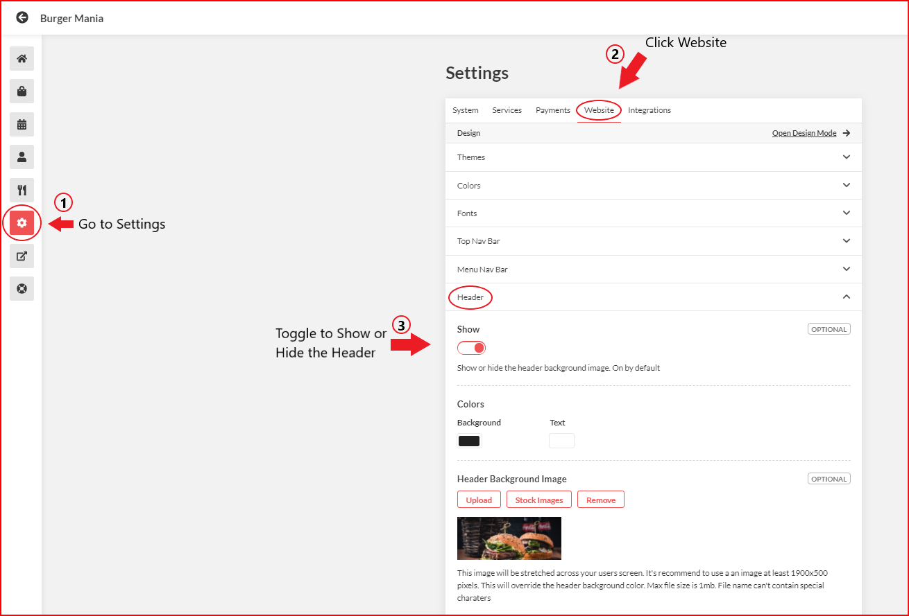

# How to Show/Hide Header Function

## Steps

<figure><figcaption>
On the Admin Dashboard, go to Settings > click Website > Header
</figcaption></figure>

<figure><figcaption>
Header function is Enabled (Header Background Image, Header Logo, Header Title and Subtitle are shown)
</figcaption></figure>

<figure><figcaption>
Header Function is Disabled (Header Background Image, Header Logo, Header Title and Subtitle are hidden)
</figcaption></figure>

