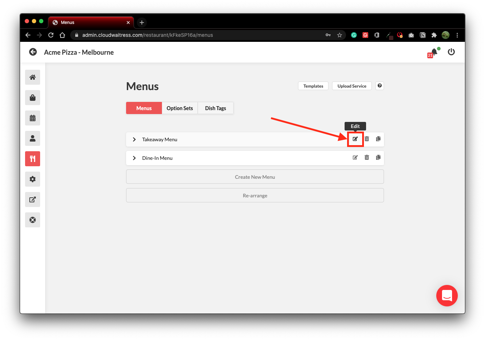

# Link Directly to menu

## Link directly to a menu

Creating a direct link to your menu is a fairly straight forward process.  The below example links to a specific menu within the demo store.

```
store-demo.cloudwaitress.com?menu_id=6kNXYMVEl
```

Replace the above url with your restaurant url;

```bash
store-demo.cloudwaitress.com > yourdomain.com
```

Replace add the menu id of the menu that you would like to link to;

```bash
menu_id=6kNXYMVEl > menu_id=id from your menu
```


 You can find the menu id by following the instructions below.


## How to find your Menu ID?

Log in to your restaurant store. Select the Menus section using the knife and fork button on the left-hand menu.  Then press the 'Edit' button on the menu that you would like to directly link to.



The menu id is displayed at the top of the page.  Use this code to directly link to your menu as per the above instructions.


