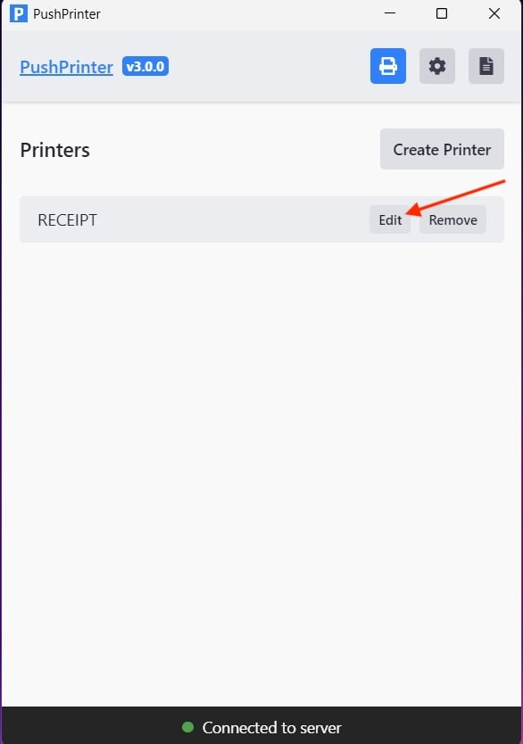

# Print Multiple Receipt Copies Automatically on Windows

### Steps:

1. Open **PushPrinter app** > click **Edit**

<figure><figcaption></figcaption></figure>

2. Change the **Number of Copies**

<figure><figcaption></figcaption></figure>

3. Click **Edit Printer** to save.

<figure><figcaption></figcaption></figure>
