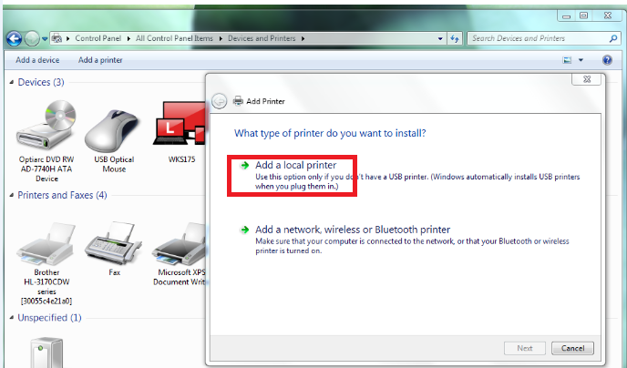
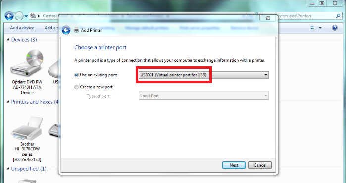
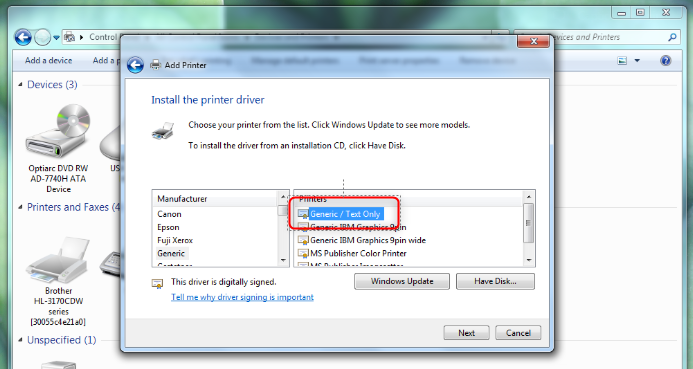
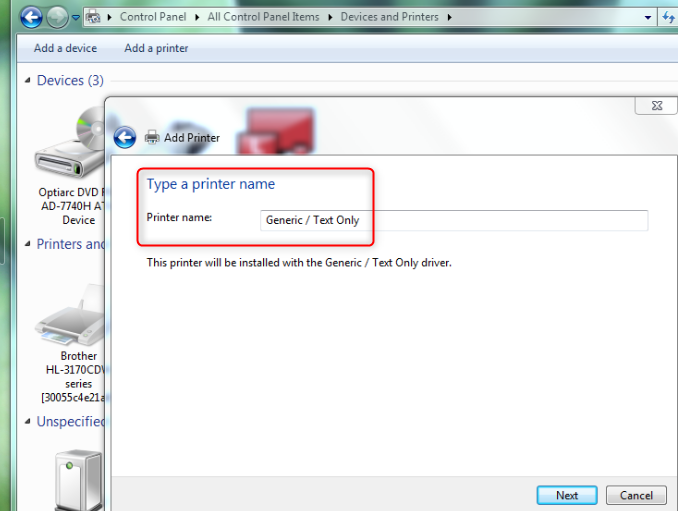
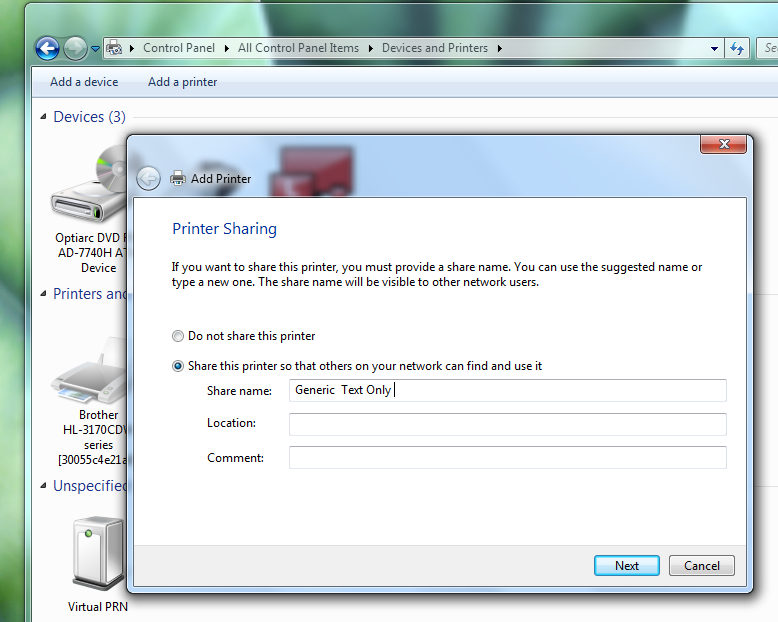
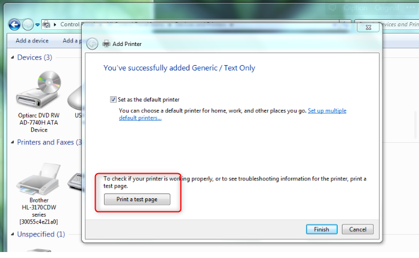

# Printing - Add a printer to Windows

If printer drivers are not set up follow these instructions:

1. Go to 'control panel', 'devices and printers', 'add a printer' and select add a local printer:

2. Choose a printer port, click use an existing port, USB001

3. Choose a printer from the list and select Generic / Text only and click next.

4. Type a printer name and click next:


Use simple naming conventions for easy servicing in the future. i.e. Kitchen, Pizza, Drinks


5. Provide a name of the printer if you want to share it and click next

6. Print a test page to check your printer is working properly and click finish if the test print worked satisfactorily.

7. Your printer is now setup.

