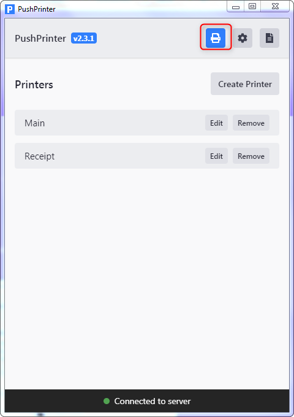

# Printing - Windows Network Printing

## **Network printing**

1. Please go to the Windows Control Panel

2. Open Devices and Printers

3. Right click and select 'Printer Properties'

4. If your printer is not showing use these instructions to set it up [Printer Set up](printing-add-a-printer-to-windows.md).

5. To test that the printer is working, please press Print Test Page

6. If the test page does not print. Then please connect and install the printer correctly. Please see : [Printer Set up](https://www.notion.so/cloudwaitresswiki/Printing-Add-a-printer-18689e4654fe4978b20aeb82b581d81e).

7. Open the PushPrinter for Windows program application

8. Go to the 'settings' cog and select the default provider profile from the dropdown list.

9. Enable 'Automatically start PushPrinter'. \(This allows the application to auto-start when resetting your machine\).

10. Press the printer button

11. Using the Create Printer button, create printer

12. Add settings including API key from the printer just created.


**For a network printer:** 

* Name the printer. 
* Add API printer \(found in the store printer settings\), 
* Set number of copies 
* Add printer IP address and set port to 9100\).



**NOTE:**

**Printer name** - This is the name that the printer will show inside of CloudWaitress.

**API Key** - This needs to be copied from the printer settings inside of CloudWaitress.

**Number of copies** - This will determine how many copies of the are printed.

**Printing type** - This needs to be set to Windows Shared Printer \(ESCPOS\) for this to work.

**Windows Share Printer Name** - This must match EXACTLY the shared printer name that was added before. You should avoid spaces and special characters.


13. Test print

14. Create printer

15. Go to your store and place a test order.

\*\*\*\*

