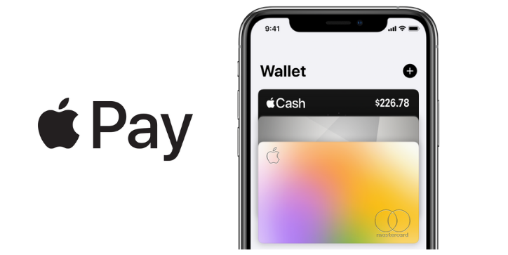
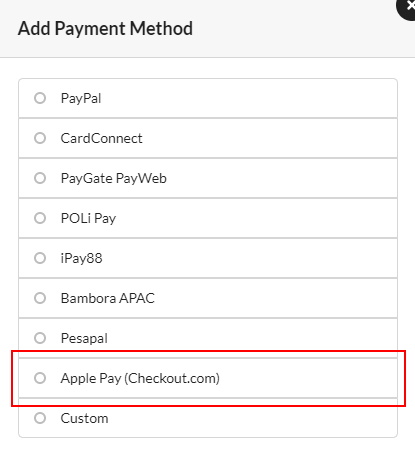
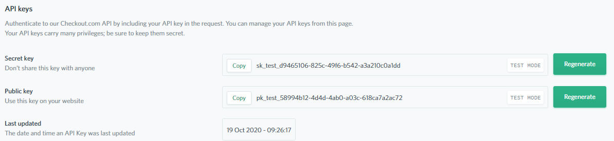
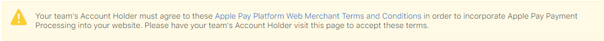

# Setup Apple Pay with Checkout.com



## How Apple Pay Works

Customers with Apple Pay-compatible devices can utilize this payment method to ease the process of credit card payment. Apple Pay eliminates the need to type the card information and shipping details manually. Customers only need to authorize the payment using biometric authentication such as Touch ID.

## Requirements

In order to configure and use Apple Pay with CloudWaitress, you need to prepare some business accounts and tools as follows:

* A Checkout.com business account. You can send an inquiry to create a new account to Checkout.com here - [https://www.checkout.com/contact-sales](https://www.checkout.com/contact-sales)
* An Apple developer account; make sure you have a proper role to create identifiers and certificates.
* A working domain with a valid SSL certificate.
* Access to `openssl` command-line tool. You can learn more about OpenSSL here - [openssl.org](https://www.openssl.org/)

## Configure Apple Pay and Checkout.com

### Create a Merchant Identifier in Apple Developer Account

1. Log in to your Apple Developer account.
2. Create your merchant by going to **Certificates, IDs & Profiles &gt; Identifiers**, click the plus button, select the **Merchant IDs** section, then click **Continue**. You can quickly access this section by access this URL - [https://developer.apple.com/account/resources/identifiers/merchant/add](https://developer.apple.com/account/resources/identifiers/merchant/add/) 
3. Choose a useful description for the merchant.
4. For merchant ID, you should use a descriptive name to indicate both your business and the environment you will use it in, for example, **merchant.com.mystore.production**.



### Configure Checkout.com as a Payment Processor

1. Log in to your **Checkout.com Hub Account -** [https://hub.checkout.com](https://hub.checkout.com/)
2. Go to **Settings &gt; Apple Pay** and click **New certificate**
3. Click **Download your certificate signing request**. You'll receive a `.csr` file. You should store this file in a convenient location as you'll need that file for your Apple Developer account.
4. Click **Continue** until step 3 and leave this page open.
5. Go back to your Apple Developer account, go to the Merchant IDs list section - [https://developer.apple.com/account/resources/identifiers/list/merchant](https://developer.apple.com/account/resources/identifiers/list/merchant), and click on the merchant you created previously.
6. Scroll to **Apple Pay Merchant Identity Certificate** section and click **Create Certificate**.
7. Select **No** to the question about processing payments in China and click **Continue**.
8. Upload the`.csr` file and click **Continue**.
9. Click Download, and store the `.cer` file that you received.
10. Go back to your Checkout.com Hub Account, and update this `.cer` file.



### Prepare the Domain for Validation

1. Go back to your [Apple Developer Account](https://drive.google.com/drive/u/1/folders/1kZMY4EHyBdbBBc-uwpaAt4sTtEPQSO_7) and access the merchant page as previous steps.
2. Under the Merchant Domains section, click Add Domain.
3. Enter the domain for your business and click Save.
4. Click Download to get the `.txt` file.
5. You should store this file in an accessible place. The domain verification step is not completed yet. We're going to get back to this as we configure Apple Pay on the CloudWaitress.

### Create your Apple Pay Certificates

1. Access your terminal and create a `.csr` and `.key` file using this command:

   ```text
   openssl req -out uploadMe.csr -new -newkey rsa:2048 -nodes -keyout certificate.key
   ```

2. Inside the terminal prompt, enter your details. Make sure you leave the password blank. You'll get a `.csr` and `.key` file.
3. Go back to your merchant page in **Apple Developer Account**.
4. Under the **Apple Pay Merchant Identity Certificate** section, click **Create Certificate**.
5. Upload the`.csr` file you created from the above command. It should be called `uploadMe.csr` if you just copy the command above.
6. Click Continue then click Download to get your `.cer` file. The file name should probably be called `merchant_id.cer`.
7. Convert the `.cer` file into a `.pem` file using the following command: 

   ```text
   openssl x509 -inform der -in merchant_id.cer -out certificate.pem
   ```



### Summary

After going through all the above steps, you should have the following at your hand:

* An Apple Merchant ID
* A configured Checkout.com account that linked to your Apple Merchant.
* A domain that linked to your Apple Merchant, and it should be in the **Pending** state for now.
* A `apple-developer-merchantid-domain-association.txt` file that is provided by Apple when you add the domain.
* A `.key` and `.pem` certificate files.

## Enable Apple Pay in CloudWaitress Dashboard

After configuring Apple Developer Account and Checkout.com, we need to do some steps on the CloudWaitress dashboard to make Apple Pay fully functional.

1. Head over your restaurant settings in your CloudWaitress dashboard.
2. Click on the **Payments** tab and click **Add Payment Method**.
3. Select **Apple Pay \(Checkout.com\)** in the payment method list, and click **Add Method**.



### Get Your Checkout.com Keys

1. Head over to your **Checkout.com Hub Account** and go to **Settings &gt; Channels**.
2. Create a new channel if necessary.
3. Access your channel, under the **API Keys** section, you can copy the **Secret key** and **Public key**.



### Update the Payment Method Settings

Next, you need to update Apple Pay \(Checkout.com\) payment method details. Specifically, we need the following fields:

| Setting Option | Description |
| :--- | :--- |
| **Checkout Secret Key** | The secret key from Checkout.com |
| **Checkout Public Key** | The public key from Checkout.com |
| **Apple Pay Merchant ID** | The identifier of your Apple Merchant, **merchant.com.mystore.production**, for example. |
| **Apple Pay Merchant Name** | The description of your Apple Merchant, you can get it inside the merchant page |
| **Apple Pay Merchant Domain** | The domain name that you registered with Apple Merchant. You should drop the `https://` and `www.` prefixes. For example, you should enter `example.com` rather than `https://example.com` |
| **Apple Pay Merchant Domain Association** | Copy the content of `apple-developer-merchantid-domain-association.txt` file and enter it here. |
| **Apple Pay Merchant Identity Certificate** | Copy the content of the `.pem` file you get in the above steps. |
| **Apple Pay Merchant Identity Private Key** | Copy the content of the `.key` file you get in the above steps. |

Click **Save** to update the settings.

### Verify the Domain

Go back to your merchant page in your **Apple Developer account**. Under the **Merchant Domains** sections, you should see your domain is currently in **Pending** status. Click **Verify**, the status of your domain should be **Verified** now.

## Troubleshooting

### Unable to Make Changes to Apple Pay Merchant



If you receive the warning about the Apple Pay Platform Web Merchant Terms and Conditions like the above image. You should ask your Apple Developer account holder to visit the merchant page, click on the link inside the warning, and accept the terms. Otherwise, you'll not be able to make changes to the merchant like adding domains or generate certificates.

### Unable to Complete the Payments

If you receive errors when processing the payments, please check the Apple Pay certificate again. You can try to generate new certificates and update your payment settings accordingly. If the problem still happens after changing the certificates, please contact us for more supports.

