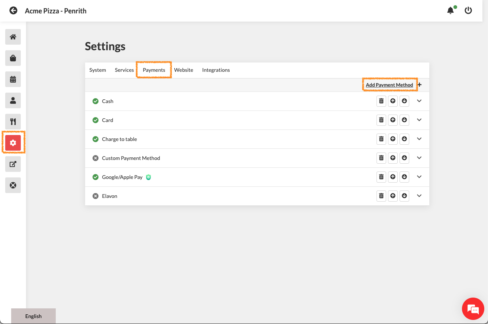

# Setup Integrated Stripe Payments

1. Login to your [admin.cloudwaitress.com](https://admin.cloudwaitress.com) dashboard.
2. Go to Settings > Payments > Add Payment Method > Stripe > Add Method

<figure><figcaption>
Settings > Payments > Add Payment Method > Stripe > Add Method
</figcaption></figure>

3. We recommend the following minimum settings for Stripe;

<table data-full-width="true"><thead><tr><th>Setting</th><th>Recommendation</th><th>Notes</th></tr></thead><tbody><tr><td>Enabled</td><td>On</td><td>Activates feature</td></tr><tr><td>Stripe Secret Key</td><td>sk_live</td><td></td></tr><tr><td>Stripe Publishable Key</td><td>pk_live</td><td></td></tr><tr><td>Currency</td><td>AUD - Australian Dollar - $</td><td>Use your local currency</td></tr><tr><td>Disable E-Mail Receipt</td><td></td><td></td></tr><tr><td>Enable Custom Payment Form</td><td></td><td></td></tr><tr><td>Layout</td><td></td><td></td></tr><tr><td>Themes</td><td></td><td></td></tr><tr><td>Services</td><td></td><td></td></tr><tr><td>Label</td><td>Pay - Online</td><td></td></tr><tr><td>Delivery Label</td><td></td><td></td></tr><tr><td>Print Label</td><td>*PAID - ONLINE*</td><td></td></tr><tr><td>Maximum Order Value ($)</td><td>999</td><td>Set as realistic maximum online order total</td></tr><tr><td>Minimum Order Value ($2)</td><td>2</td><td>Minimum transaction should not be lower than $2</td></tr><tr><td>SC Account ID</td><td>GET THIS FROM SUPPORT Example format - acct_1A3abABCABCac1aA</td><td>Contact chat/<a href="mailto:support@cloudwaitress.com">email</a> support to activate your SC ACCOUNT ID </td></tr></tbody></table>

4. Press Save
5. Launch your store and place a live test order with your Card, Google Pay or Apple pay.


Please email [support@cloudwaitress.com](mailto:support@cloudwaitress.com) or use the chat support feature to get assistance activating this feature.


If you do not already have a CloudWaitress account, please visit [www.cloudwaitress.com](https://www.cloudwaitress.com) and press the [Sign Up](https://www.cloudwaitress.com/signup/) button on the top right.


[using-stripe-integrated.md](using-stripe-integrated.md)

