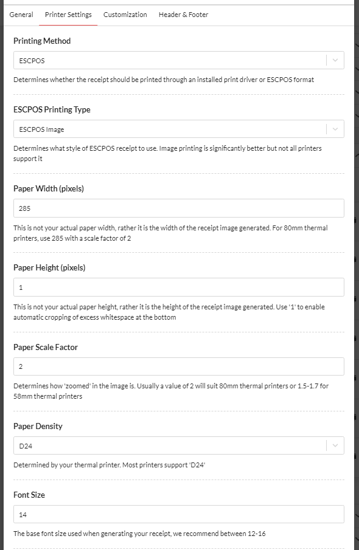

# Setup Printing For Android

Our system allows you to manually and automatically print out new orders. This guide will show you how to set order printing and troubleshoot issues.

\|\| We are happy to remotely set up your printer for you. We know this is a step that can trip up many people due to every printer being a bit different. Please get in touch with us if you need assistance.

## Requirements

* An Android device with Android 1.4 or above
* A ESC/POS compatible printer
* Latest version of PushPrinter that can be downloaded [here](https://www.pushprinter.com)

## Setup Process

### Create A Printer Configuration

1. Visit your restaurant dashboard and navigate to "Settings &gt; Receipt Printing"
2. Press the "New Printer" button and fill out any options needed
3. On the "Printer Settings" tab, set your Printer Method to 'ESCPOS' and ESCPOS Printing Type to 'ESCPOS Image'.  Note that some older printers may not support this method and ESCPOS Text Only can be used in these cases.
4. The defauly paper settings work for most printers.  If the test print is cutting of the edge of the text, please adjust the Paper Scale Factor to 1.7 and test again.
5. Create the print configuration. After creating it, you will get a unique API key to connect to it. Keep this screen open as you will need to copy your API key soon.

### Install PushPrinter

1. Download PushPrinter from the following [link](https://www.pushprinter.com)
2. After it is installed successfully, PushPrinter will automatically open

### Configure PushPrinter

1. Press the "Settings Cog" and select Default.
2. Press on the "Printer Icon" tab at the top to configure a printing service
3. Copy and paste the API key for the printer you created 2 steps ago
4. Set the number of copies to print and select your printer
5. Press the test print button
6. Press the "Create Printer" button and make sure it says connected at the bottom

### Test Print

Visit your orders page. Select an order, under the action select bar, select print. We recommend printing both short and long orders to ensure that there is nothing being cut out vertically. If you have enabled auto-printing for this print configuration, place an order and test out the auto printing

## Troubleshooting

#### Contact Us

We have successfully setup 100's of printers, there is a good chance we can save you lots of headaches so please don't hesitate to contact us.

#### Sides being cut-off

Start by reducing either your Paper Scale Factor to 1.7 and test print again.  Adjust until it fits.

#### Invalid API Key

The API key you entered does not below to any of your print configurations. Double check your API key

#### Could Not Authenticate

Check your internet connection or try again shortly

#### Printing not working even though everything is set up correctly

Please ensure that Android detects your printer. Try restarting your device. Try printing to your printer from other programs on your PC such as your browser.

