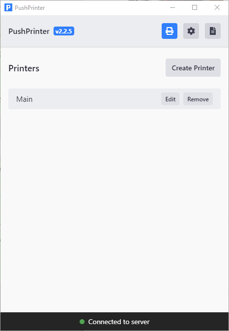

# Setup Printing For Windows

Our system allows you to manually and automatically print out new orders. This guide will show you how to set order printing and troubleshoot issues.

\|\| We are happy to remotely set up your printer for you. We know this is a step that can trip up many people due to every printer being a bit different. Please get in touch with us if you need assistance

## Requirements

* Windows 7 / 8 / 10 either 32-bit or 64-bit
* A Windows-compatible printer with the drivers installed
* Latest version of PushPrinter that can be downloaded [here](https://pushprinter.net)

In some rare instances, when the above does not work, you may require;

* Latest .NET framework by Microsoft installed \(might already be installed on Windows 10\). Download [here](https://www.microsoft.com/en-us/download/details.aspx?id=55170) 

\|\| If you are unable to install the latest .NET framework due to an outdated operating system, there are 3 options. First, proceed with the steps below and see if printing works anyways. Second, update your Windows as required for the .NET framework. Third, proceed with the steps below and make sure to configure Ghostscript as shown at the bottom of the instructions.

## Setup Process

### Verify Printer Drivers Are Installed & Working

1. If your drivers are successfully installed, your printer will be shown on your PC under "Control Panel &gt; Hardware and Sound &gt; Devices and Printers"
2. Right-click your printer and select "Properties"
3. On the bottom left, press "Print Test Page". 
4. Verify that the test page successfully printed

If this is successful, your printer will work fine. If you cannot find your printer or it doesn't work, reinstall the driver again.

### Take Note Of The Paper Sizes Available

This step is slightly different for all printers. Some printers provide their own configuration tool where you can view the paper sizes available.

By default, you might find this information under your printer "Properties" dialogue as described in the previous step. Sometimes this is found under the "Device Settings" tab in your printer properties.

Other times you may select "Preferences" at the bottom of the printer properties popup and then select "Advanced" at the bottom again

Refer to the image below to see what this may look like.

Take note of the paper sizes available as you will likely need to try a few to get it working flawlessly

### Create A Printer Configuration

1. Visit your restaurant dashboard and navigate to "Settings &gt; Receipt Printing"
2. Press the "New Printer" button and fill out any options needed
3. On the "Paper Settings" tab, set your paper width and paper height according to the largest available paper size available for your printer as noted in the previous step. Going off the image above, we would enter a width of "72" and a height of "210"
4. We highly recommend starting with a font size of "18" and a paper margin of "0"
5. Create the print configuration. After creating it, you will get a unique API key to connect to it. Keep this screen open as you will need to copy your API key soon

\|\| The paper sizes entered in your printer configuration must match your Windows paper size settings as set in the printer driver options. If the printout is incorrect or skewed, you will need to test out the other sizes from largest to smallest. When changing the sizes in the printer configuration make sure to change it in the Windows printer driver settings.

### Install PushPrinter

1. Download PushPrinter from the following [link](https://pushprinter.net)
2. Run the installer, you will get a warning that the application is unverified, proceed with the installation
3. After it is installed successfully, PushPrinter will automatically open

### Configure PushPrinter

1. The first thing you will likely want to do is toggle the "Auto Start" switch so it connects and starts when your PC is started.  Activate this by selecting the "Settings Cog" and ticking the 'Automatically start PushPrinter' button \(image 1.1\).
2. Press on the "Printer Icon" tab at the top to configure a printing service
3. Press "Create Printer" button \(image 1.2\).
4. Copy and paste the API key for the printer you created 2 steps ago
5. Set the number of copies to print and select your printer
6. Press the start button and make sure it says connected at the bottom

### Test Print

Visit your orders page. Select an order, under the action select bar, select print. We recommend printing both short and long orders to ensure that there is nothing being cut out vertically. If you have enabled auto-printing for this print configuration, place an order and test out the auto printing

### Ghostscript Printing


Only do this if you cannot update the .NET framework or you are unable to get printing to work correctly


Ghostscript is an application that can assist with printing on older Windows devices that do not support the latest .NET framework from Microsoft. It also allows for a completely different method of printing. This can help alleviate printing issues if you are not able to get things working correctly.

To use Ghostscript, you must:

1. Visit this [website](https://www.ghostscript.com/download/gsdnld.html) and download the GNU public license version of Ghostscript
2. Run the installer and take note of the installation directory.
3. Open PushPrinter, in the first tab at the bottom, press the field "Ghostscript Path". Navigate to your installation folder. Inside, there will be another folder called "bin". Open that and select either "gswin32c.exe" or "gswin64c.exe"
4. Exit PushPrinter completely making sure to close it in the Windows tray and then open it again

At this point, Ghostscript will be configured and you can test printing with it. Ghostscript is very fussy about paper sizes. You must ensure that your online printer configuration paper size matches your Windows driver paper size exactly.

## Troubleshooting

#### Contact Us

We have successfully setup 100's of printers, there is a good chance we can save you lots of headaches so please don't hesitate to contact us.

#### Sides being cut-off

Start by reducing either your margin or paper width values under your printer configuration in your admin dashboard. You will eventually calibrate a suitable width and margin. You can also adjust the font size to something smaller. You can get your correct paper width under your Windows printer settings as seen in the guide above.

#### The end of the receipt doesn't come out fully

Under your Windows printer settings. Set your "Feed Line After Printing" option to a high value to allow the printer to feed through a few extra lines.

#### Excess whitespace at the end of a receipt

Thermal printers generally trim out any excess whitespace when printing. If this is happening to you, please contact us.

#### Invalid API Key

The API key you entered does not below to any of your print configurations. Double check your API key

#### Could Not Authenticate

Check your internet connection or try again shortly

#### Printer not being detected in Windows

You need to find the correct driver for your printer provided its available for Windows. Try googling your printer name followed by the words "windows {insert your windows version} driver"

#### Printing not working even though everything is set up correctly

Please ensure that Windows detects your printer. Try restarting your printer or PC. Try printing to your printer from other programs on your PC such as your browser.

