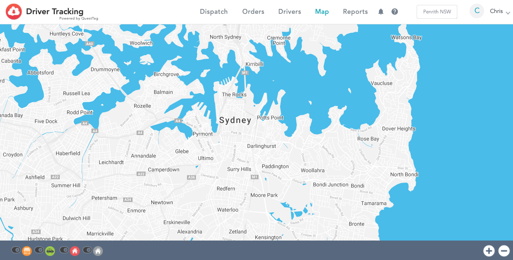

# How to add Driver Tracking

## Features

* Easy-to-use dashboard
* CloudWaitress orders automatically added
* Real-time tracking of drivers for restaurant and customer
* Mobile app for drivers
* Customer email notifications
* Driver payments and tips tracking
* Customer text notifications \(paid\)
* Auto-dispatching \(paid\)

## Set-up Shipday Integration



1. Open your CloudWaitress account - [admin.cloudwaitress.com](https://admin.cloudwaitress.com/).
2. Select 'Manage' for the Restaurant you would like to integrate.
3. Go to 'Settings' &gt; 'Integrations' &gt; Click on the 'Shipday Logo'.
4. Paste the Shipday API key from your Shipday.com account.
5. Check the 'Enabled' button and press save.
6. The integration is now live.


Please make sure that you have Wait Times & Auto Statuses configured.  Otherwise, the integration will not work.

**Find at**: 'Settings &gt; Services &gt; Deliveries &gt; Wait Times & Auto Statuses'.


## 

