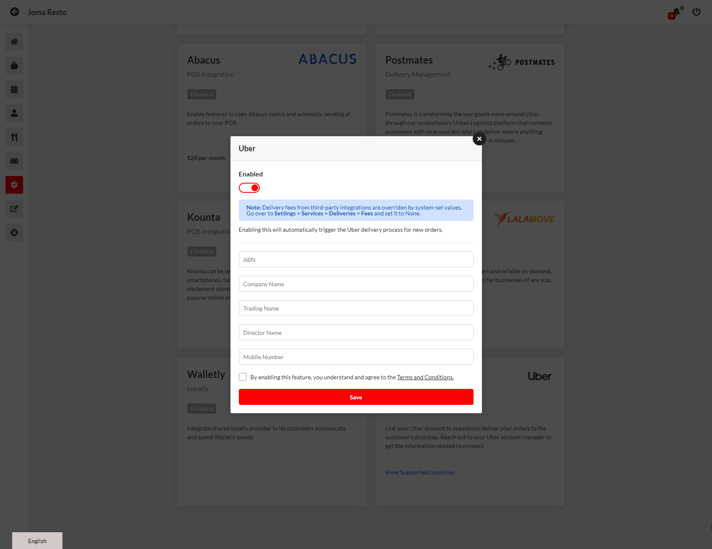

# Uber Direct Setup Manual

## **Requirements**

To enable Uber deliveries, the restaurant should have all the following:

* Stripe Connect
* Restaurant from the following countries:
  * Australia
  * New Zealand

## Enabling Uber

Uber DaaS is a reliable and convenient way to get your food delivered quickly and efficiently. Here's how to enable it:

1. On the Admin Dashboard, click Settings > Integrations and find the Uber Delivery Management card and click on it.

<figure><figcaption></figcaption></figure>

2. A popup will open and fill up the information. Click Save.

<figure><figcaption></figcaption></figure>

3. Set Uber as Default Delivery

Once you have enabled Uber DaaS, you can select the Default Delivery Provider in the Settings > Services > Deliveries (as shown in the image below)

<figure><figcaption></figcaption></figure>

### Notes:

* Make sure that your Map Data Source is Google Maps. Go to Settings > System > Location > Map Data Source.

<figure><figcaption></figcaption></figure>

* Currency must match the country’s location and Uber country availability. Go to Settings > System > General > Currency.

<figure><figcaption></figcaption></figure>

* Uber requires valid phone number from your store (Must have the country code). Go to Settings > System > Location > Phone Number.

<figure><figcaption></figcaption></figure>

## Checkout Details

Once a customer checkout an order, the Uber (if set as the Default Delivery Provider in Admin Dashboard) will be displayed as the Delivery Provider.

<figure><figcaption></figcaption></figure>

#### The Delivery Estimation will provide the:

**Delivery Provider** - which is Uber

**Estimated Fee** - the total fee

**Tips** - entered by the user and will be sent to the Uber driver directly

**Estimated Delivery Time** - time from now to drop off

#### The acceptable Payment Method will be the following:

**Credit Card** - if enabled and with Stripe Connect account ID provided

**Apple Pay** | **Google Pay (Stripe**) - if enabled

## Order Workflow

Once the customer made the order, in Admin Dashboard, the order’s thumbnail will be replaced to the Uber logo (denoting that it will use Uber)

#### Order: UNCONFIRMED

<figure><figcaption></figcaption></figure>

#### Order: CONFIRMED

The order **SHOULD** go through to the **CONFIRMED** status to trigger the Uber delivery request.

Once the order is set to CONFIRMED, the Delivery Tracking URL will be available both in the ADMIN and the CUSTOMER.

<figure><figcaption>
Admin Order View
</figcaption></figure>

<figure><figcaption>
Customer Order View
</figcaption></figure>

<figure><figcaption>
Sample Screenshot of the Tracking URL
</figcaption></figure>

<figure><figcaption>
SMS sent by Uber to the recipient.
</figcaption></figure>

#### Order: READY

<figure><figcaption>
Customer Order View
</figcaption></figure>

It is expected that the driver is still on route to the restaurant or is waiting in the restaurant.

#### Order: ON ROUTE

<figure><figcaption>
Admin Order View
</figcaption></figure>

#### Order: CANCELLED

If the Order is cancelled (initiated by the customer or the store), the Uber delivery will be automatically cancelled as well

