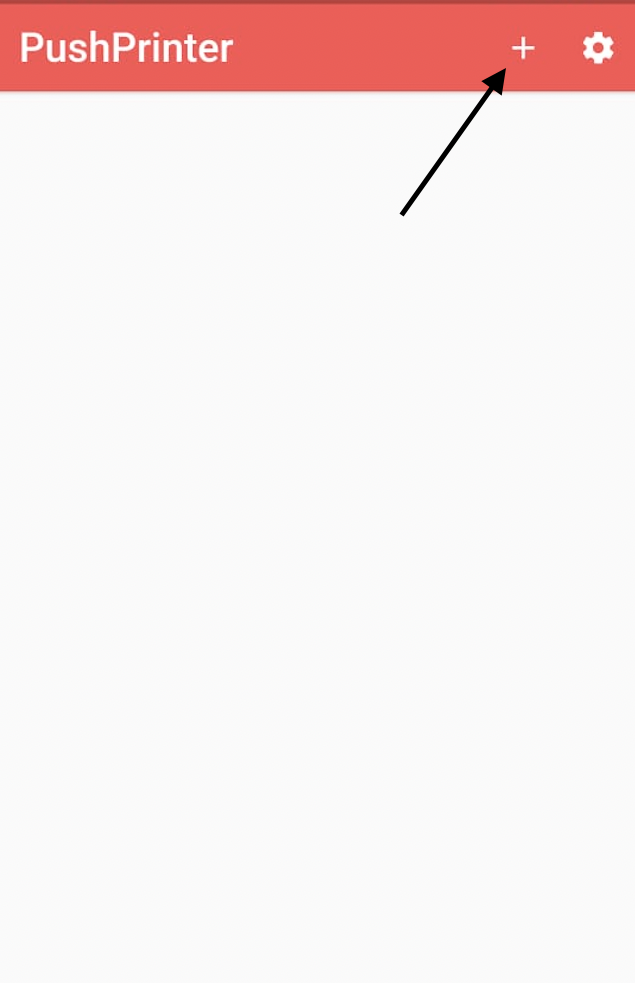

# Setup Printing For Android

Our system allows you to manually and automatically print out new orders. This guide will show you how to set order printing and troubleshoot issues.

|| We are happy to remotely set up your printer for you. We know this is a step that can trip up many people due to every printer being a bit different. Please get in touch with us if you need assistance.

## Requirements

* An Android device with Android 1.4 or above
* A ESC/POS compatible printer
* Latest version of PushPrinter that can be downloaded [here](https://www.pushprinter.com)

## Setup Process

### Create A Printer Configuration

1.  Visit your restaurant dashboard and navigate to "Settings > Receipt Printing > Create Printer"\

    <figure><figcaption></figcaption></figure>
2. Fill out the following:
   * Printer Name
   * Go to Printer Settings and make sure that the Printing Method is “ESCPOS” and the Printing Type is in ESCPOS Image. (Note that some older printers may not support this method and ESCPOS Text Only can be used in these cases.
   * The default paper settings work for most printers. If the test print is cutting off the edge of the text, please adjust the Paper Scale Factor to 1.7 and test again.

3\. Once all the printer configuration is done, click "Save"

4\. After creating it, you will get a unique API key to connect to it. Keep this screen open as you will need to copy your API key soon.

.png>)

### Install PushPrinter

1. Download PushPrinter from Playstore, or click on this [link](https://www.pushprinter.com)
2. After it is installed successfully, PushPrinter will automatically open

### Configure PushPrinter

1. Press the "Settings Cog" and select Default.

## .png>)

 (2).png>)

2\. Press the "+” sign on the top to configure a printing service. Make sure that the printer is on.

&#x20;

3\. Pair the Android device to the printer via Bluetooth

.png>)

4\. Once it’s successfully connected, a test print will be sent to the printer.

5\. Fill out Printer Details such as the Printer Name, API Key and Number of Copies.

Note: If it will ask for a pin code, oftentimes, it is “0000” or “1234”

.png>)

* API can be found on the restaurant's printer settings. (Settings > Receipt Printing)
* Ensure that the API is correct.

6\. Once all the details are filled out, check the status of the printer on your restaurant’s settings. Make sure it appears as connected.

 (1).png>)

### Test Print

Visit your orders page. Select an order, under the action select bar, select print. We recommend printing both short and long orders to ensure that there is nothing being cut out vertically. If you have enabled auto-printing for this print configuration, place an order and test out the auto printing

.png>)

## Troubleshooting

#### Contact Us

We have successfully setup 100's of printers, there is a good chance we can save you lots of headaches so please don't hesitate to contact us.

#### Sides being cut-off

Start by reducing either your Paper Scale Factor to 1.7 and test print again.  Adjust until it fits.

#### Invalid API Key

The API key you entered does not below to any of your print configurations. Double check your API key

#### Could Not Authenticate

Check your internet connection or try again shortly

#### Printing not working even though everything is set up correctly

Please ensure that Android detects your printer. Try restarting your device. Try printing to your printer from other programs on your PC such as your browser.


Get started for free at [www.cloudwaitress.com/signup](https://www.cloudwaitress.com/signup/)


