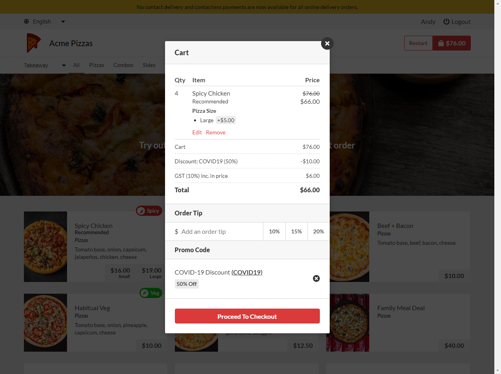
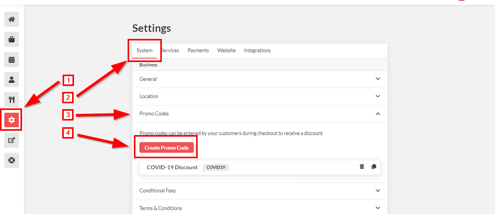
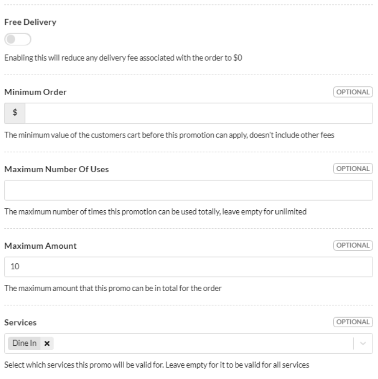
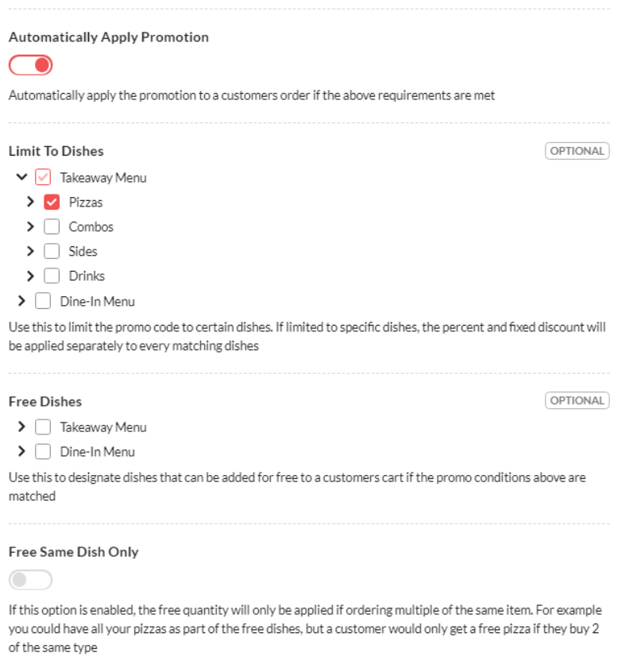
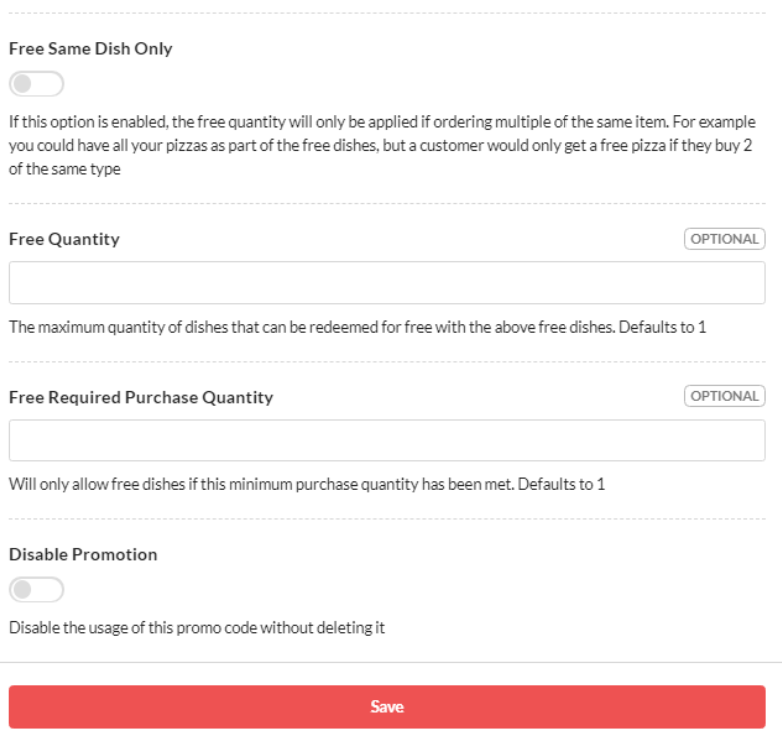

# COVID-19 Discount for United Kingdom

## Example

Below shows an example of the COVID-19 discount applied to the checkout.

## Set-up Process

CloudWaitress supports the COVID-19 Discount for Dine-In orders with the following settings;

### **Labels**

We suggest using the following naming conventions;

**Name** = 'COVID-19 Discount'

**Promo Code** = 'COVID19'

### **Restrictions**

Please ensure that Maximum Amount = "10" and Services = "Dine In"

### Rules

Leave 'Order Times', 'Once Per Customer' and 'Logged In Customers Only' set as blank/off.

### Critical Settings

You must set 'Automatically Apply Promotion' to on.

Limit to dishes should have every applicable item selected. For example, all food items would be ticked and alcohol items would not be ticked.

### Non-important settings

The following settings should be left blank.

### Go Live

You can now save the promotion to make it live.

### How to disable promotion

Turning off the COVID-19 promotion is very simple.  Simply open the promotion, check the disable promotion setting.  Alternatively you can delete the promotion from the promotions menu \(Settings &gt; System &gt; Promo Codes &gt; Delete\) by hitting the trash can button on the right-hand side of the promotion in question.


**Limitations** 

The COVID-19 discount will only be applied once per order.  In order to obtain a discount for multiple people, each person should order from their own device.


